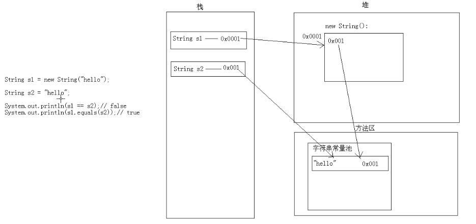

[Toc]

# 字符串一旦被赋值就无法被改变
```
/**
 * Created by lucode on 2017/3/3.
 */
public class Demo01 {
    /*
    * 字符串一旦被赋值就无法被改变(事实上是值无法改变)
    * 字符串直接赋值的方式,先去字符串常量池里面找,如果有直接返回
    * 没有的话,就创建,然后返回
    * */
    @Test
    public void test() {
        //在常量池里面假设地址为 0X001 里面值是 hello 地址返回给栈区的0X001
        String str1 = "hello";
        //先在常量池里面创建0X002里面的值是world
        //然后,进行字符串拼接操作,形成 helloworld
        //最后 赋值给 0X003,返回给栈区的 str1
        str1 += "world";
        // 打印结果是 helloworld
        System.out.println(str1);
    }
}
```


#  s = new String("hello") s = "hello"区别?
图解

```
    /**
     * String s = new String("hello");和String s = "hello"的区别?
     * 前者创建了两个对象,后者创建了一个对象
     */
    @Test
    public void test2() {
        // s1 在栈区  new String()在堆区创建,
        // 然后去常量池找 hello 这个,没有的话创建一个
        String s1 = new String("hello");
        // 直接去 常量池 找 hello ,返回
        String s2 = "hello";
        System.out.println(s1.equals(s2)); //true
        System.out.println(s1 == s2);//false

    }
```
# ==  和  equals()  的比较

```
/*
* ==  和  equals()  的比较
*/
    @Test
    public void test3() {
        String s1 = new String("hello");
        String s2 = new String("hello");
        // s1和s2 分别创建了两个对象 new 出来的 在堆区的地址不一样
        System.out.println(s1 == s2);// false
        System.out.println(s1.equals(s2));// true

        String s3 = new String("hello");
        String s4 = "hello";
        System.out.println(s3 == s4);// false
        System.out.println(s3.equals(s4));// true

        String s5 = "hello";
        String s6 = "hello";
        // s5和 s6 在常量池里面找
        // 前者先创建,后者发现前者创建过,所以直接引用就可以
        System.out.println(s5 == s6);// true
        System.out.println(s5.equals(s6));// true

    }
```
# 字符串拼接

```
    //字符串的拼接
    @Test
    public void test4() {
        String s1 = "hello";
        String s2 = "world";
        String s3 = "helloworld";
        // 字符串变量相加 先开空间,再相加
        System.out.println(s3 == s1 + s2);// false
        System.out.println(s3.equals((s1 + s2)));// true
        // 字符串常量相加 先相加,再开辟空间
        // (如果发现加完后的字符串在常量池里面存在,那么直接引用存在的)
        System.out.println(s3 == "hello" + "world");// 应该是true
        System.out.println(s3.equals("hello" + "world"));// true
        // 其实通过反编译 发现,在编译的时候已经把 hello 和 world 拼接在一起了
        // System.out.println(s3 == "helloworld"); 反编译后发现是这样的
    }
```
