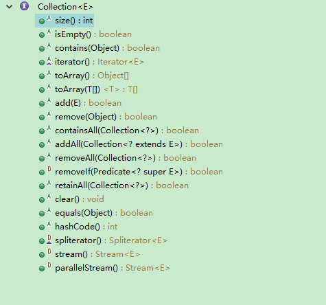

# Collection的方法
Collection表示的数据集合有基本的增、删、查、遍历等方法.  
下面是他的完整的方法图

# Collection的子接口 
 
 
* 1.List  
表示有顺序或位置的数据集合，增加了根据索引位置进行操作的方法。  
>它有两个主要的实现类:
>* ArrayList(底层是数组)  
    随机访问效率很高，但从中间插入和删除元素需要移动元素，效率比较低
>* LinkedList(底层是链表)  
> 随机访问效率比较低，但增删元素只需要调整邻近节点的链接。
   
   
* 2.Set(不重复)  
它没有增加新的方法，但保证不含重复元素。  
> 它有三个主要的实现类:  
>* HashSet(基于哈希表实现)  
   要求键重写hashCode方法，效率更高，但元素间没有顺序.
   有一个子类:LinkedHashSet可以按插入有序
>* TreeSet(基于排序二叉树实现)  
元素按比较有序，元素需要实现Comparable接口，
或者创建TreeSet时提供一个Comparator对象。
> * EnumSet(基于向量)  
> 针对枚举类型的实现类,效率很高。

* 3.Queue  
表示先进先出的队列，在尾部添加，从头部查看或删除。  
> Queue的子接口:
> * Deque  
> 表示更为通用的双端队列，有明确的在头或尾进行查看、添加和删除的方法。  

> Deque的实现类:
> * LinkedList(基于链表,实现 Deque接口)
> * ArrayDeque(循环数组)  
> 如果只需要Deque接口，ArrayDeque的效率更高一些。
> * PriorityQueue  
> 它表示优先级队列，内部是用堆实现的，堆除了用于实现优先级队列，
> 还可以高效方便的解决很多其他问题，比如求前K个最大的元素、求中值等。

