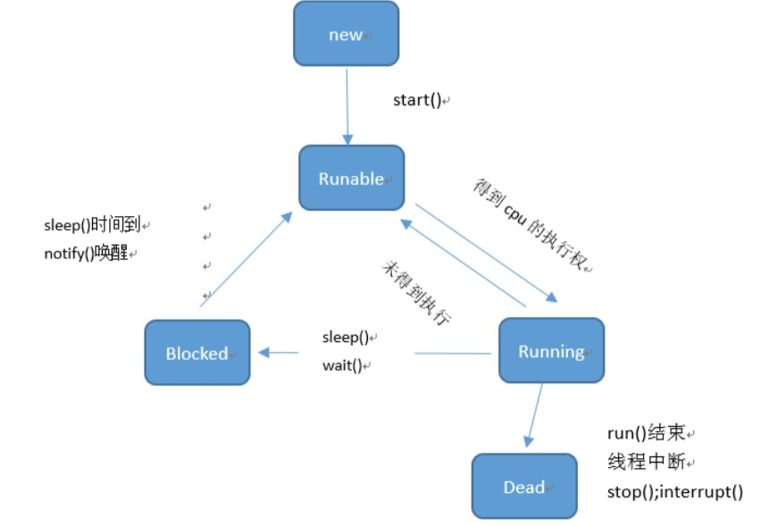

[Toc]
# Java中的多线程

### 4.如何实现多线程
* 方法一

> myThread继承Thread类,在里面重写run()方法,run()方法里面写需要执行的多线程的代码段main方法中 实例化myThread方法,然后启动线程 调用th.start()

说明：这里面的run()方法只是对代码的封装

* 方式二:
> 多线程大多数采用的Runable()接口来完成，具体见下文。

### 5.多线程的名字
* 方法1：Thread类中有getName()和setName()方法
* 方法2：构造方法Thread(String name) 直接设置名字
> 注意：在子类myThread类中，子类必须重写父类Thread这个构造方法才能完成调用

#### 如何知道当前执行的线程的名字
> static Thread currentThread() ：返回对当前正在执行的线程对象的引用。

例如得到main方法执行的线程方法如下

```java
public class ThreadDemo {
    public static void main(String [] args) {
       System.out.println(Thread.currentThread().getName());
    }
}
```

### 6.线程优先级
> 默认5 最大10 最小0


```java
getPriority()和 setPriority()方法
```

> 优先级高的线程获取的CPU时间片几率（多次试验才能看到效果）相对多一些。

>附：
> 线程有两种调度模型：
>* 分时调度模型   
> 所有线程轮流使用 CPU 的使用权，平均分配每个线程占用CPU 的时间片
>* 抢占式调度模型  
  优先让优先级高的线程使用CPU，如果线程的优先级相同，那么会随机选择一个，优先级高的线程获取的 CPU 时间片相对多一些。 
  
>* Java使用的是抢占式调度模型。

### 7.线程的控制
* 线程休眠——传入的参数为毫秒(静态方法直接在run()中调用)
> public static void sleep(long millis)

* 线程加入——在线程启动后调用，调用后该线程执行完后才能执行其他线程
> public final void join()

* 线程礼让——静态方法，可以run()的时候调用，保证（不是完全保证）一个线程实行一次
> public static void yield()

* 后台线程(守护线程)——刘备(主线程死掉)死后关羽张飞线程马上死掉

>优先级：守护线程的优先级比较低，用于为系统中的其它对象和线程提供服务。  
>举例:GC 线程(垃圾回收)就是典型的守护线程  
> 方法:
> public final void setDaemon(boolean on)// ture


```java
//定义一个多线程
public class ThreadDaemon extends  Thread{
    @Override
    public void run() {
        for (int i=0;i<100;i++){
             // 打印进程名字
             System.out.println(getName()+":"+i);
        }
    }
}
```

```java

public class ThreadDaemonDemo {
    // 将上面定义好的进程设置为守护线程
    public static void main(String[] args) {
        ThreadDaemon td1 = new ThreadDaemon();
        ThreadDaemon td2 = new ThreadDaemon();
        td1.setName("关羽");
        td2.setName("张飞");
        // 设置守护线程
        td1.setDaemon(true);
        td2.setDaemon(true);
        //主线程刘备死后，关张死掉（可能存在点延迟cpu跑太快）
        td1.start();
        td2.start();
        // 主进程
        Thread.currentThread().setName("刘备");
        for (int x = 0; x < 5; x++) {
            System.out.println(Thread.currentThread().getName() + ":" + x);
        }
    }
}
```


### 8.中断线程
> ~~public final void stop()~~ 已过时不安全

> public void interrupt()

```java
public class ThreadStop extends Thread {
    // 定义一个延迟 50s 的线程类
    @Override
    public void run() {
        System.out.println("线程开始："+new Date());
        try {
            Thread.sleep(50000);
        } catch (InterruptedException e) {
            System.out.println("线程被终止了....");
        }
        //如果用stop()方法这后面的代码就执行不到了 被认为是不安全的
        System.out.println("线程结束："+new Date());
    }
}
```

```java
public class ThreadDemo {
    public static void main(String[] args) {
        ThreadStop ts=new ThreadStop();
        ts.start();
        //超过3秒该线程 醒不来 直接抛异常
        try {
            Thread.sleep(3000);
            //线程上如果等待3秒直接进去run()中sleep里面的异常，
            // 被认为是InterruptedException
            ts.interrupt();
        } catch (InterruptedException e) {
            e.printStackTrace();
        }
    }
}
```


### 9.线程的生命周期

* 新建(New)：创建线程对象
* 就绪(Runable)：有执行资格，没有执行权
* 运行(Running)：有执行资格，有执行权
* 阻塞(Blocked)：没有执行资格，没有执行权，一个操作可以让线程处于该状态，另外一个操作可以让他激活，激活后处于激活状态
* 死亡(Dead)：线程对像变成垃圾，等待被回收

转换图


 
### 10.实现Runable()接口来完成多线程
为什么会有第二种方法呢？
>加入继承Thread类的子类还需要继承其他类，这时候就需要用到  

步骤：
* A:自定义类MyRunnable实现Runnable接口
* B:重写run()方法
* C:创建MyRunnable类的对象
* D:创建Thread类的对象，并把C步骤的对象作为构造参数传递

```java
public class MyRunnable implements Runnable {
    @Override
    public void run() {
        for (int i = 0; i <100 ; i++) {
            System.out.println(Thread.currentThread().getName()+"-"+i);
        }
    }
}
public class ThreadDemo {
    public static  void main(String []args){
        MyRunnable myRunnable=new MyRunnable();
        Thread thread=new Thread(myRunnable,"线程");
        thread.start();
    }
}

```


### 11.线程安全(模拟买票例子)

```java
//多个窗口卖票
//实现Runable 方式来创建多线程   
public class SellTicket implements Runnable{
   private  int tickets=100;
    @Override
    public void run() {
        //模拟不停的在卖票
        while(true) {
            if (tickets > 0) {
                System.out.println(Thread.currentThread().getName() +
                        "正在出售第" + tickets-- + "张票");
            }
        }
    }
}

public class SellTicketDemo {
    public static void main(String []args){
        SellTicket st=new SellTicket();
        // 开启多个线程
        Thread thread1=new Thread(st,"窗口1");
        Thread thread2=new Thread(st,"窗口2");
        Thread thread3=new Thread(st,"窗口3");
        thread1.start();
        thread2.start();
        thread3.start();
    }
}
```

上面的 写法在多线程的安全上面会出现问题（写上延迟效果就出来了）
> 现象:相同的票出现多次  
> 原因:CPU的一次操作必须是原子性的  
> 现象:还出现了负数的票  
> 原因:随机性和延迟导致的  

解决
同步代码块

```java
//同步代码块
public class SellTicket implements Runnable{
    private  int tickets=100;
    //设置对象 相当于同一把锁
    private Object ob=new Object();
    @Override
    public void run() {
        while(true) {
            // 只能一个进程进去 其他等待
            synchronized (ob) {
                if (tickets > 0) {
                    try {
                        Thread.sleep(100);
                    } catch (InterruptedException e) {
                        e.printStackTrace();
                    }
                    System.out.println(Thread.currentThread().getName() +
                            "正在出售第" + tickets-- + "张票");
                }
            }
        }
    }
}
```
小结
* 1.同步代码块的锁对象是任意对象,(上面就是直接使用 obj 对象)
* 2.同步方法的锁对象是 this,当前实例
* 3.静态方法的锁对象是class类的字节码文件  

注:锁对象----
synchronized (ob) {//同步代码块}  
小括号里面的就称为是锁对象  

详细解释看另外一篇文章  

---
下面演示剩余两点  
同步方法的锁对象是 this

```java
public class SellTicket implements Runnable{
    private  int tickets=100;
    private int x=0;
    @Override
    public void run() {
        while(true) {
            if (x % 2 == 0) {
                //this 为锁对象
                synchronized (this) {
                    if (tickets > 0) {
                        try {
                            Thread.sleep(100);
                        } catch (InterruptedException e) {
                            e.printStackTrace();
                        }
                        System.out.println(Thread.currentThread().getName() +
                                "正在出售第" + tickets-- + "张票");
                    }
                }
            }else{
                fun();
            }
            x--;
        }
    }
    public synchronized void fun(){
        if (tickets > 0) {
            try {
                Thread.sleep(100);
            } catch (InterruptedException e) {
                e.printStackTrace();
            }
            System.out.println(Thread.currentThread().getName() +
                    "正在出售第" + tickets-- + "张票");
        }

    }
}
```

静态方法的锁对象是 class  类的字节码文件
```java
public class SellTicket implements Runnable{
    private  static  int tickets=100;
    private int x=0;
    @Override
    public void run() {
        while(true) {
            if (x % 2 == 0) {
                //class 为锁对象
                synchronized (SellTicket.class) {
                    if (tickets > 0) {
                        try {
                            Thread.sleep(100);
                        } catch (InterruptedException e) {
                            e.printStackTrace();
                        }
                        System.out.println(Thread.currentThread().getName() +
                                "正在出售第" + tickets-- + "张票");
                    }
                }
            }else{
                fun();
            }
            x--;
        }
    }
    public static synchronized void fun(){
        if (tickets > 0) {
            try {
                Thread.sleep(100);
            } catch (InterruptedException e) {
                e.printStackTrace();
            }
            System.out.println(Thread.currentThread().getName() +
                    "正在出售第" + tickets-- + "张票");
        }
    }
}
```

### 12集合线程安全的做法
```java
public class Demo {
    public static void main(String []args){
        //这样写线程是不安全的
        List<String> list=new ArrayList<String>();
        //推荐这个写法
        List<String> list2= Collections.synchronizedList(new ArrayList<String>());
    }
}
```