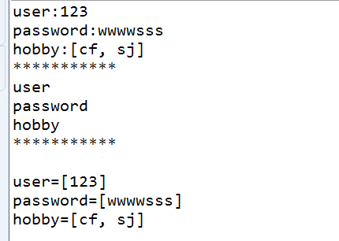

request
=========================
### 获取用户数据
    public class AServlet extends HttpServlet {
	 public void doGet(HttpServletRequest request, HttpServletResponse response)
			throws ServletException, IOException {
        //1.得到ip
		String ip=request.getRemoteAddr();
	    //2.得到请求方式
	     String method=request.getMethod();
	    //3.获取名字为User-Agent
	     String useragent=request.getHeader("User-Agent");
	    //4.设置字符编码方式，在页面输出
		response.setContentType("text/html;charset=UTF-8");
		PrintWriter out = response.getWriter();
		out.println("ip:"+ip+" ");
		out.println("method:"+method+" ");
		out.println("useragent:"+useragent+" ");
		out.flush();
		out.close();
	}
    }

### 获取请求URL

> http://localhost:8080/MyBlog/AServlet?username=xxx&password=yyy
 
* String getScheme()：获取协议，http
* String getServerName()：获取服务器名，localhost
* String getServerPort()：获取服务器端口，8080
* String getContextPath()：获取项目名，/MyBlog
* String getServletPath()：获取Servlet路径，/AServlet
* String getQueryString()：获取参数部分，即问号后面的部分。username=xxx&password=yyy
* String getRequestURI()：获取请求URI，等于项目名+Servlet路径。/MyBlog/AServlet
* String getRequestURL()：获取请求URL，等于不包含参数的整个请求路径。http://localhost:8080/MyBlog/AServlet

### 防盗链
    public class BServlet extends HttpServlet {
    
	public void doGet(HttpServletRequest request, HttpServletResponse response)
			throws ServletException, IOException {
           String re=request.getHeader("Referer");
           //只要不是从localhost访问或者
           if(re==null||!re.contains("localhost")){
        	   System.out.println(re);
         //不是正常渠道来的就直接转到官网页面再次访问
        	   //如果是图片资源直接不给显示response.sendError(404,"内容存在就是不给你看");  
        	   response.sendRedirect("http://localhost:8080/ServletDemo4/index.jsp");  
           }else{
         //正常渠道 直接进去资源页面
        	   response.setCharacterEncoding("utf-8");  
               response.setContentType("text/html;charset =utf-8");  
               PrintWriter pw = response.getWriter();  
               pw.write("官网渠道喜剧片《东成西就》");     	   
           }
	}
    }

### 获取请求参数
    public class AServlet extends HttpServlet {
	public void doGet(HttpServletRequest request, HttpServletResponse response)
			throws ServletException, IOException {
		System.out.println("Get:" + request.getParameter("xxx"));
		System.out.println("Get:" + request.getParameter("yyy"));
	}
	public void doPost(HttpServletRequest request, HttpServletResponse response)
			throws ServletException, IOException {
		String user = request.getParameter("user");
		String password = request.getParameter("password");
		String[] hobby = request.getParameterValues("hobby");
		System.out.println("user:" + user);
		System.out.println("password:" + password);
		System.out.println("hobby:" + Arrays.toString(hobby));
		// 一次性获取全部参数名字
		System.out.println("***********");
		Enumeration names = request.getParameterNames();
		while (names.hasMoreElements()) {
			System.out.println(names.nextElement());
		}
		// Map 封装
		System.out.println("***********");
		Map<String, String[]> map = request.getParameterMap();
		for (String name : map.keySet()) {
			String[] values = map.get(name);
			System.out.println(name + "=" + Arrays.toString(values));
		}
	}
    }

html页面代码
   
    <h1>数据测试页面</h1>
     

     <a href="/ServletDemo5/AServlet?xxx=XXX&yyy=YYY">点击这里</a>
     <form  action="/ServletDemo5/AServlet" method="post">
             用户：<input type="text" name="user" > 
             密码：<input type="password" name="password" > 
     hobby: <input type="checkbox" name="hobby" value="cf">eating 
     <input type="checkbox" name="hobby" value="sj">sleeping 
     <input type="checkbox" name="hobby" value="wyx">playing 
     <input type="submit" value="提交">
     </form>

控制台输出结果  
   

###  请求转发和包含
假设这里面有两个Servlet，分别叫oneServlet,twoServlet
要求我们从twoServlet转发到oneServlet
注意一旦twoServlet出现执行，就会抛出异常（一个Servlet能完完成就不需要另外的Servlet来完成）

**请求转发**：地址名字不变，保留响应头，但是不保留页面
> request.getRequestDispatcher("/oneServlet").forward(request, response);

**请求包含**：地址名字不变，保留响应头，也保留页面
> request.getRequestDispatcher("/oneServlet").include(request, response);

### 通过request域设置参数

 >request.setAttribute("name", "zhangsan");

 >request.getAttribute("name")

### request.setAttribute和request.getParameter()区别

request.getParameter()通常是通过post或者 get 数据
