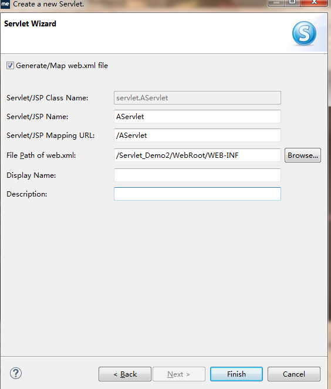

Servlet简单概述
================
* 一些话：

  >javaee三大组件之一（Servlet，JSP，EJB）
  
  >Servlet类由程序员编写，调用对象服务器完成
  
  >单例，一个类只有一个对象；当然可能存在多个Servlet类！

* 实现Servlet三种方式

  >	实现接口javax.servlet.Servlet；
  >	
  >继承类javax.servlet.GenericServlet；
  >
  >继承类javax.servlet.http.HttpServlet；多数采用这个

## 创建Servlet(配置)

###  web3.0之前中还是需要配置web.xml

   配置如下

    <servlet>
      <servlet-name>AServlet</servlet-name>
      <servlet-class>servlet.AServlet</servlet-class>
    </servlet>
    <servlet-mapping>
      <servlet-name>AServlet</servlet-name>
      <url-pattern>/AServlet</url-pattern>
    </servlet-mapping>

  * AServlet是类名  
  * class属性下 sevlert是包名
  * pattern属性下是访问的路径名
   

   当然也可以直接在myEclipse创建Servlet类，在导向的时候加入
   

### web3.0之后

直接创建Servlet类，去掉xml勾选(一定要)

在每个Servlet前面增加

    @WebServlet(urlPatterns = "/访问路径")  

记得添加版本号
   
    private static final long serialVersionUID = 1L;