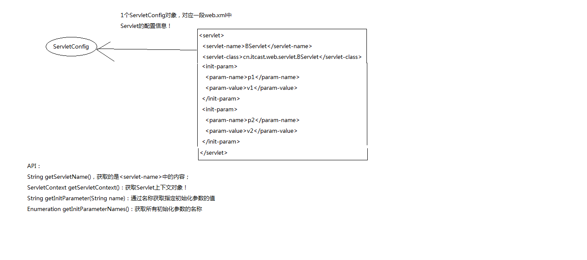

ServletConfig简单介绍
============================
* 一个ServletConfig对象对应xml中一段配置信息
* 是一个接口，实现类由Tomcat提供
* 四个方法
  >String getInitParameter(String name)根据名字得到初始化参数的值

  >Enumeration getInitParameterNames() 获取所有初始化的名字
  
  >ServletContext getServletContext() Servlet上下文
 
  >String getServletName() xml中的 `<Servlet-name>`值

  注释 这里的初始化参数表示xml下的参数
```xml

    <servlet>   
      <servlet-name>One</servlet-name>
      <servlet-class>OneServlet</servlet-class>
     <init-param>
      	   <param-name>paramName1</param-name>
    	   <param-value>paramValue1</param-value>
     </init-param>
     <init-param>
    	    <param-name>paramName2</param-name>
    	    <param-value>paramValue2</param-value>
     </init-param>
    </servlet>
```

 

