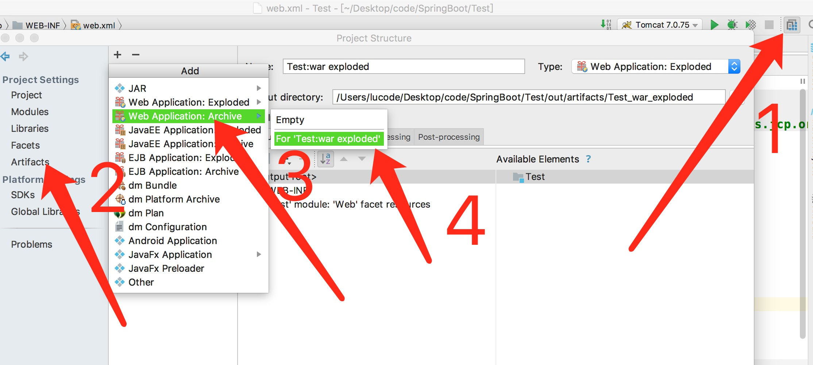

# 1. 目标
* 基于 web 3.0 注解方式完成 Servlet

* 打包成 war 方式部署

# 2.Servlet 实现

```
@WebServlet(name = "AServlet",urlPatterns="/hello")
public class AServlet extends HttpServlet {
    protected void doPost(HttpServletRequest request, HttpServletResponse response) throws ServletException, IOException {

    }
    protected void doGet(HttpServletRequest request, HttpServletResponse response) throws ServletException, IOException {
        //1.得到ip
        String ip=request.getRemoteAddr();
        //2.得到请求方式
        String method=request.getMethod();
        //3.获取名字为User-Agent
        String useragent=request.getHeader("User-Agent");
        //4.设置字符编码方式，在页面输出
        response.setContentType("text/html;charset=UTF-8");
        PrintWriter out = response.getWriter();
        out.println("ip:"+ip+"<br>");
        out.println("method:"+method+"<br>");
        out.println("useragent:"+useragent+"<br>");
        out.flush();
        out.close();
    }
}

```
其他的和以前都是一样的，不一样的地方就是
```
@WebServlet(name = "AServlet",urlPatterns="/hello")
```
只要写上 url 路径 就能访问到

## 2.IDEA 导出 war



然后
菜单栏上选择build下的Build Artifacts就出来
