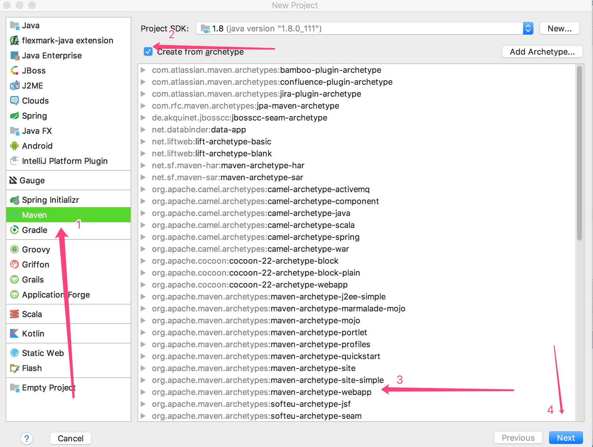
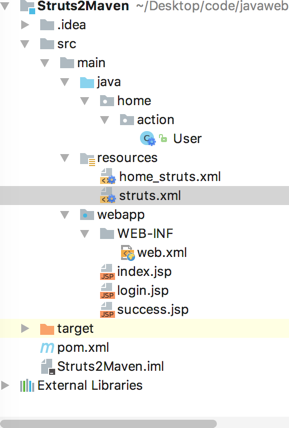
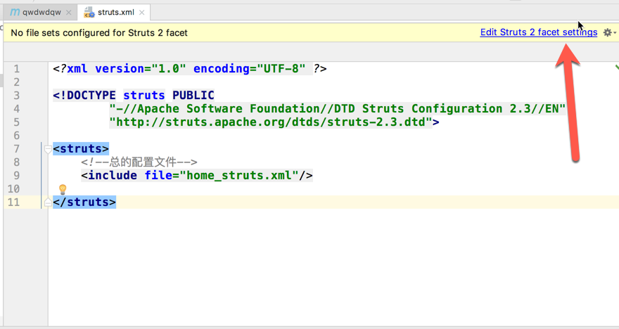
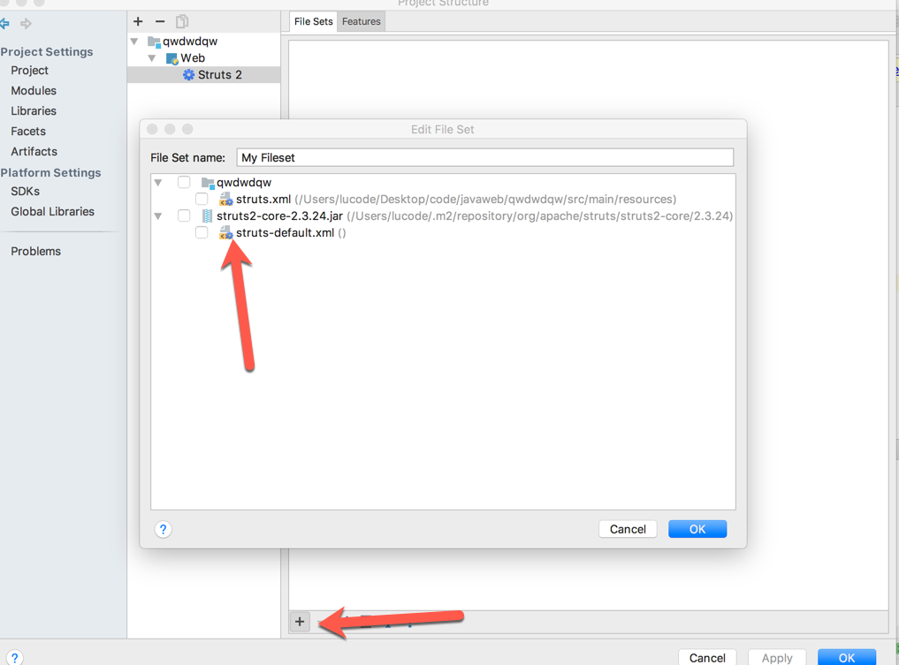

# 1.目标
   * 在 IDEA 环境下 使用 Maven 部署 Struts2项目

   * 简单开发一个用户登录功能

# 2.预先环境
主要是定好 jdk 的版本，在「杂货」文件夹有设置方法
我这里采用 jdk1.8
# 3.创建项目



# 4.pom.xml 配置
增加以下内容
```
<!-- 属性配置 -->
  <properties>
    <project.build.sourceEncoding>UTF-8</project.build.sourceEncoding>
  </properties>

  <dependencies>
    <dependency>
      <groupId>junit</groupId>
      <artifactId>junit</artifactId>
      <version>3.8.1</version>
      <scope>test</scope>
    </dependency>
    <!-- struts2核心依赖包 -->
    <dependency>
      <groupId>org.apache.struts</groupId>
      <artifactId>struts2-core</artifactId>
      <version>2.3.24</version>
    </dependency>
    <dependency>
      <groupId>javax.servlet</groupId>
      <artifactId>servlet-api</artifactId>
      <version>3.0-alpha-1</version>
    </dependency>
  </dependencies>
```
#  5. 配置 web.xml的核心过滤器
整个 web.xml
```
<!DOCTYPE web-app PUBLIC
 "-//Sun Microsystems, Inc.//DTD Web Application 2.3//EN"
 "http://java.sun.com/dtd/web-app_2_3.dtd" >

<web-app>
  <display-name>Archetype Created Web Application</display-name>

  <!-- 此处用来配置struts2的核心过滤器Filter -->
  <filter>
    <filter-name>struts2</filter-name>
    <filter-class>
      org.apache.struts2.dispatcher.ng.filter.StrutsPrepareAndExecuteFilter
    </filter-class>
  </filter>
  <filter-mapping>
    <filter-name>struts2</filter-name>
    <url-pattern>/*</url-pattern>
  </filter-mapping>

  <welcome-file-list>
    <welcome-file>index.jsp</welcome-file>
  </welcome-file-list>
</web-app>

```

# 6. 配置 Struts2的配置文件
我采用「总配置文件」+「分配置文件」的方式
配置文件必须放在resources 目录下
(其他目录下发现编译的时候无法被放入 classes 目录下)
resources 目录就相当于 src 目录


## 6.1配置文件详情
### 6.1.1 struts.xml是总配置文件
```
<?xml version="1.0" encoding="UTF-8" ?>
<!DOCTYPE struts PUBLIC
        "-//Apache Software Foundation//DTD Struts Configuration 2.3//EN"
        "http://struts.apache.org/dtds/struts-2.3.dtd">
<struts>
    <!--总的配置文件-->
    <!--去包含分配置文件-->
    <include file="home_struts.xml"/>
</struts>
```

### 6.1.2 分配置文件
```
<?xml version="1.0" encoding="UTF-8" ?>
<!DOCTYPE struts PUBLIC
        "-//Apache Software Foundation//DTD Struts Configuration 2.3//EN"
        "http://struts.apache.org/dtds/struts-2.3.dtd">
<struts>
    <package name="default" extends="struts-default" namespace="/">
        <action name="login" class="home.action.User" method="login">
            <result name="success">success.jsp</result>
            <result name="login">login.jsp</result>
        </action>
    </package>
</struts>
```
### 6.1.3 配置文件加载




# 7.编写 jsp和 action 类
三个 jsp 页面 (不写了)
* index.jsp

* login.jsp

* success.jsp

action 类
```java
package home.action;

import com.opensymphony.xwork2.ActionSupport;
import org.apache.struts2.ServletActionContext;
import javax.servlet.http.HttpServletRequest;
import javax.servlet.http.HttpServletResponse;
import java.io.UnsupportedEncodingException;

/**
 * Created by lucode on 2017/4/29.
 */
public class User extends ActionSupport {
    public String login() {
        try {
            HttpServletRequest request = ServletActionContext.getRequest();
            HttpServletResponse response = ServletActionContext.getResponse();
            request.setCharacterEncoding("UTF-8");
            response.setContentType("text/html;charset=utf-8");
            String username = request.getParameter("username");
            String password = request.getParameter("password");
            //页面跳转  测试作用 用户名和密码  写死了
            if ("admin".equals(username) && "1".equals(password)) {
                return SUCCESS;
            } else {
                //return "login";
                return  LOGIN;
            }
        } catch (UnsupportedEncodingException e) {
            e.printStackTrace();
        }
        return SUCCESS;
    }
}

```
# 8. 打工告成


