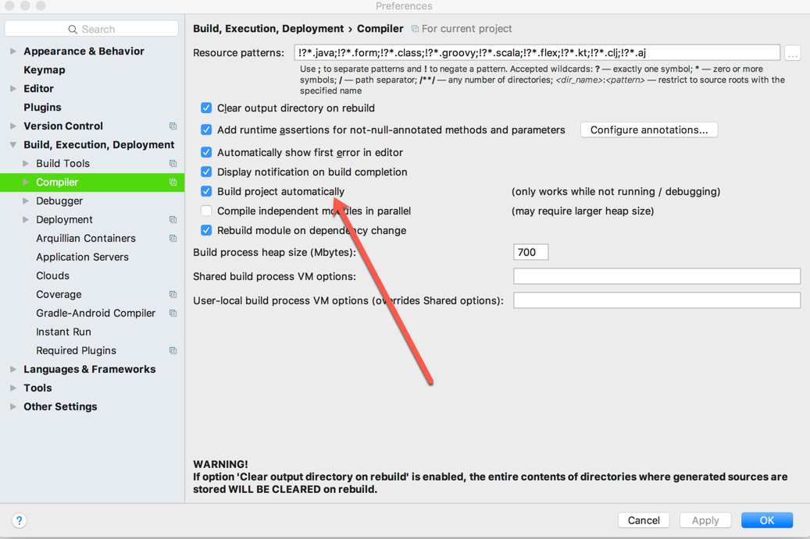
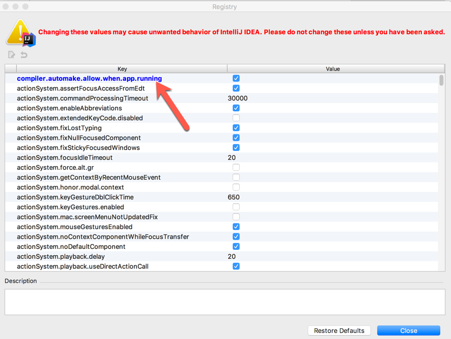

# 1. 开始
SpringBoot热部署有三种方式
> 第一种：Spring Loaded

> 第二种：Spring-boot-devtools

> 第三种：IDEA 提供的插件 JRebel


# 2.Spring-boot-devtools

其实这个方式只是用来完成一个自动重启的工作(省去了手动重启的，并没有加快多少的速度)
注意：这个是只针对 MAC用户使用的 IDEA 进行配置，windows 用户只做参考
## 2.1 添加pom 配置
```
<dependency>
  <groupId>org.springframework.boot</groupId>
  <artifactId>spring-boot-devtools</artifactId>
  <optional>true</optional>
</dependency>
```
添加完之后还需要进行下面两步设置

## 2.2 设置IDEA自动编译（一）

打开设置 箭头指向的地方打钩
找不到的话搜索 compiler


## 2.3 设置IDEA自动编译（二）
compiler.automake.allow.when.app.running 勾选
方式：在Maintenance打开Registry找到....app.running
**完成以上2.2和2.3之后要重启 IDEA**
> mac下 你可以使用快捷键  shift+alt+command+/ 选择第一个，找到Registry

> 如果用快捷键开打不开的话设置里面找到Maintenance，就能看到快捷键



# 3. 使用插件 JRebel

没用过 ，付费软件

# 4. Spring Loaded
 日后在研究