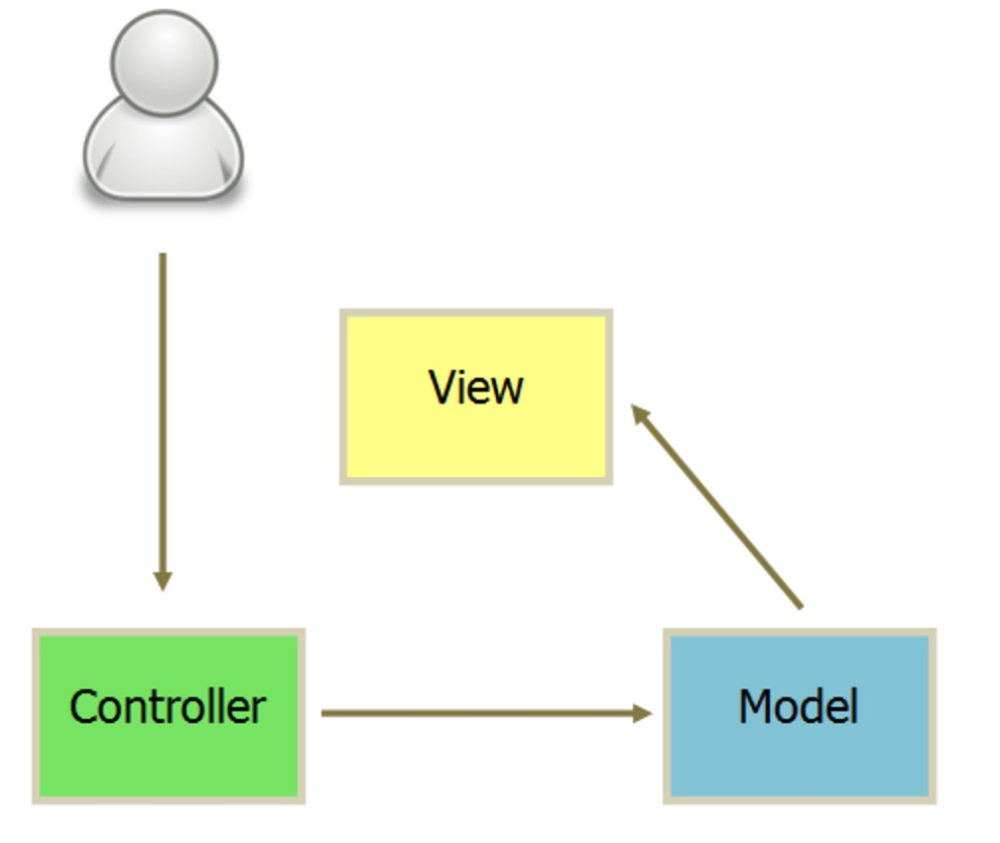

* 视图（View）：用户界面
* 控制器（Controller）：业务逻辑
* 模型（Model）：数据保存

### 间通讯方式

* View 传送指令到 Controller
* Controller 完成业务逻辑后，要求 Model 改变状态
* Model 将新的数据发送到 View，用户得到反馈

所有的通讯都是单向的
### 互动模式
接受用户指令时，MVC 可以分成两种方式。
一种是通过 View 接受指令，传递给 Controller。

另一种是直接通过controller接受指令。
